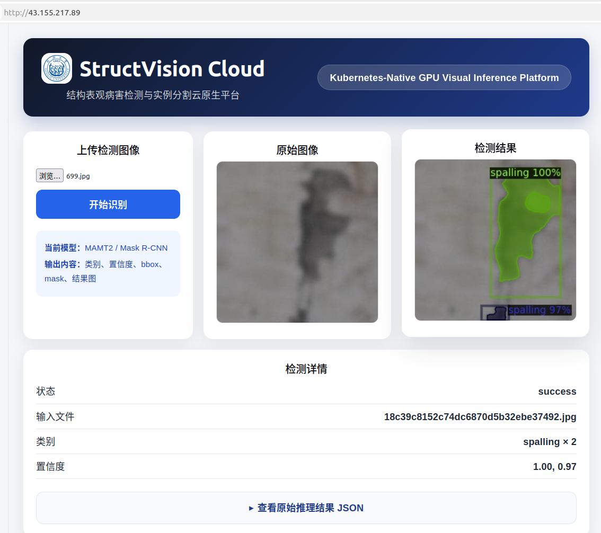
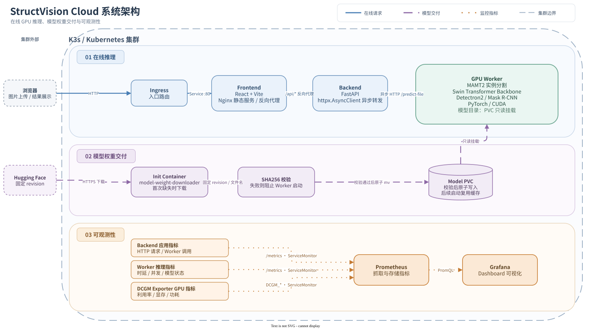
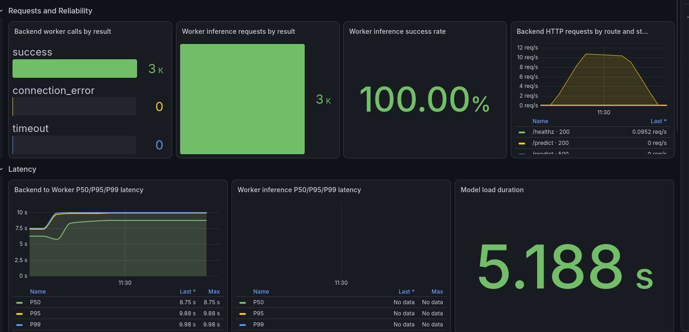
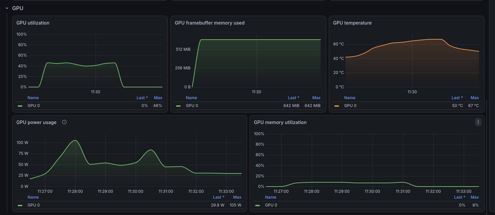

# StructVision Cloud

[](https://github.com/DavidYz1/structvision-cloud/actions/workflows/ci.yml)


StructVision Cloud 将 MAMT2 / Detectron2 实例分割模型拆成 React Frontend、FastAPI Backend 和独立 GPU Worker，并用 Docker、Kubernetes/K3s 与 Helm 部署到 GPU 云服务器。浏览器上传图片后，Backend 通过异步 HTTP 调用 Worker，Worker 在 NVIDIA GPU 上完成真实推理并返回实例框、类别、置信度、mask 和结果图。

<p>
  
  
  
  
  
  
  
  
  
  
</p>

## 效果展示



页面通过 `/api/predict` 上传图片，显示原图、实例分割结果、类别和置信度。结果区域也保留原始 JSON，便于核对模型输出。

## GPU 云服务器部署

正式配置使用 `helm/values-release.yaml` 中公开的 GHCR 镜像和不可变 digest。服务器需要准备：

- Linux x86_64、NVIDIA 驱动和可用的容器运行时；
- Kubernetes 或 K3s、`kubectl`、Helm 3；
- NVIDIA Device Plugin，并确保节点公开 `nvidia.com/gpu`；
- ingress-nginx，或者使用下面的 `port-forward` 访问；
- 能够访问公开 GHCR 和 Hugging Face。

先确认 GPU 已经进入 Kubernetes 调度资源：

```bash
kubectl get nodes \
  -o custom-columns=NAME:.metadata.name,GPU:.status.allocatable.nvidia\\.com/gpu
```

Chart 默认创建 ServiceMonitor。新集群应先安装 kube-prometheus-stack，等待 CRD 就绪，再安装应用：

```bash
helm repo add prometheus-community \
  https://prometheus-community.github.io/helm-charts
helm repo add nvidia \
  https://nvidia.github.io/dcgm-exporter/helm-charts
helm repo update

helm upgrade --install kube-prometheus-stack \
  prometheus-community/kube-prometheus-stack \
  --namespace monitoring \
  --create-namespace \
  --values monitoring/kube-prometheus-stack-values.yaml \
  --wait \
  --timeout 15m

kubectl wait \
  --for=condition=Established \
  crd/servicemonitors.monitoring.coreos.com \
  --timeout=120s

helm upgrade --install dcgm-exporter \
  nvidia/dcgm-exporter \
  --namespace monitoring \
  --create-namespace \
  --values monitoring/dcgm-exporter-values.yaml
```

安装 StructVision：

```bash
helm upgrade --install structvision ./helm \
  --namespace structvision \
  --create-namespace \
  --values helm/values-release.yaml
```

如果暂时不安装 Prometheus Operator，需要在首次安装时关闭 ServiceMonitor：

```bash
helm upgrade --install structvision ./helm \
  --namespace structvision \
  --create-namespace \
  --values helm/values-release.yaml \
  --set monitoring.serviceMonitor.enabled=false
```

检查 Pod、Service、Ingress、PVC 和发布状态：

```bash
kubectl get pods,services,ingress,pvc --namespace structvision
kubectl rollout status deployment/frontend \
  --namespace structvision --timeout=5m
kubectl rollout status deployment/backend \
  --namespace structvision --timeout=5m
kubectl rollout status deployment/mamt2-worker \
  --namespace structvision --timeout=15m
```

查看首次权重下载和 SHA256 校验日志：

```bash
kubectl logs deployment/mamt2-worker \
  --namespace structvision \
  --container model-weight-downloader
```

进入 Worker 检查 GPU：

```bash
kubectl exec deployment/mamt2-worker \
  --namespace structvision \
  --container worker \
  -- nvidia-smi
```

`values-release.yaml` 将 `ingress.host` 设为空字符串，Ingress rule 不限制域名，可由 Ingress Controller 的外部地址访问：

```bash
kubectl get ingress mamt2-ingress --namespace structvision
```

也可以不依赖公网地址，直接转发 Frontend Service：

```bash
kubectl port-forward \
  --namespace structvision \
  service/frontend 8080:80
```

然后访问 <http://127.0.0.1:8080>。监控安装、验证和故障排查见 [监控说明](monitoring/README.md)。

## 系统架构



[查看可编辑的 draw.io 源文件](docs/images/system-architecture.drawio)

Frontend 只面对浏览器；Backend 和 Worker 通过集群内 Service 通信。模型权重走单独的 Init Container 与 PVC 链路，不经过浏览器、Backend，也不会写入 Worker 镜像。

## 核心模块

### Frontend

Frontend 使用 React 19 和 Vite 8。用户选择图片后，页面用字段名 `file` 构造 `multipart/form-data`，向 `/api/predict` 发送请求并展示结果图、类别、置信度和原始 JSON。生产镜像使用 Node.js 20 构建静态文件，再由 Nginx 提供页面；Nginx 将 `/api/*` 反向代理到 `backend:8000`。

### Backend

Backend 使用 Python 3.10 和 FastAPI。`POST /predict` 接收上传文件并写入 Pod 临时目录，随后复用 FastAPI 生命周期管理的 `httpx.AsyncClient`，调用 Worker 的 `POST /predict-file`。调用超时仍为 120 秒，Worker 的非 2xx、非 JSON、失败状态和缺失字段都会被拒绝。

Backend 目前不单独维护 MIME、图片尺寸或扩展名白名单；图片是否能正常解码由 Worker 的 MAMT2 输入检查处理。`GET /healthz` 只检查进程能否响应，`GET /readyz` 表示应用已启动，两者都不会访问 Worker。`/metrics` 暴露 HTTP 请求量、请求延迟、并发请求数、Worker 调用结果和调用延迟。

### GPU Worker

Worker 使用 Python 3.12.3、PyTorch `2.11.0+cu128`、CUDA 12.8、Detectron2 0.6 和仓库内的 MAMT2 runtime。部署的 MAMT2 模型以 Swin Transformer 为核心 Backbone，通过 Swin-FPN 提取多尺度特征，再由 Detectron2 / Mask R-CNN 完成剥落目标的定位与实例分割。FastAPI 接收图片后，Worker 加载已经训练完成的模型权重，并通过 PyTorch 和 CUDA 执行真实 GPU 推理。

模型训练不在云端 Worker 中进行；这个服务只负责模型加载和推理。模型对象在第一次请求时加载到进程内并复用，因此正式压测前需要先预热一次。

Detectron2 0.6 wheel 面向 CPython 3.12 / Linux x86_64 构建，源码 revision、容器补丁、GitHub Release 下载地址和 SHA256 都固定在[运行时与模型产物清单](model/manifest.yaml)中，镜像构建时会校验 wheel。当前清单和无 GPU layout 测试只静态记录 `sm_86`；云端 T4 真实推理已经通过，但仓库还没有保存能证明 wheel 同时包含 `sm_75` 与 `sm_86` 的 fatbin 架构清单，因此这里不额外推断。

模型权重不进入 Git 或 Worker 镜像。Init Container 按清单中的 Hugging Face 固定 revision 和文件名下载权重，完成 SHA256 校验后原子写入 PVC；Worker 只读挂载最终文件。具体仓库、revision、文件名和哈希以同一清单为准。

## 镜像与 Kubernetes/Helm 部署

Frontend、Backend 和 Worker 分别构建为独立的 `linux/amd64` 镜像并发布到公开 GHCR。正式配置同时保存便于识别源码版本的 tag 和不可变 digest；当 digest 非空时，Helm 实际渲染 `repository@sha256:...`，Pod 拉取内容不由 tag 决定，也不依赖 `latest`。三个镜像当前使用的 repository、tag 和 digest 统一记录在 [`helm/values-release.yaml`](helm/values-release.yaml)，对应的 GHCR Package 需要保持 public，集群才能匿名拉取。

Chart 管理 Frontend、Backend、Worker 的 Deployment 和 Service，以及 ConfigMap、Ingress、模型 PVC、Backend/Worker ServiceMonitor 和 Grafana Dashboard ConfigMap。Worker 声明 `nvidia.com/gpu: 1`，Kubernetes 会把它调度到有一张可用 GPU 的节点。

单 GPU 环境无法在更新时同时运行新旧两个 Worker Pod，所以 Worker Deployment 使用 `Recreate`：旧 Pod 退出并释放 GPU 后再启动新 Pod。这样会有短暂中断，但不会因为第二张 GPU 不存在而让 RollingUpdate 一直 Pending。

模型 PVC 为空或现有文件校验失败时，`model-weight-downloader` 使用唯一 `.part` 文件下载固定权重；下载失败会清理临时文件，SHA256 不一致会阻止 Worker 启动，校验成功后才原子替换正式文件。Pod 重建会复用已经校验通过的缓存。

默认下载不使用代理。网络受限时，代理变量只进入 Init Container：

```bash
helm upgrade --install structvision ./helm \
  --namespace structvision \
  --create-namespace \
  --values helm/values-release.yaml \
  --set worker.model.download.proxy.enabled=true \
  --set-string worker.model.download.proxy.httpProxy=http://proxy.example.invalid:3128 \
  --set-string worker.model.download.proxy.httpsProxy=http://proxy.example.invalid:3128
```

本地单节点 Minikube 仍可使用默认 values 和本地镜像：

```bash
minikube start --profile mamt2 --driver=docker --gpus=all
minikube --profile mamt2 addons enable ingress
kubectl config use-context mamt2

eval "$(minikube --profile mamt2 docker-env)"
docker build --tag mamt2-frontend:v1 frontend
docker build --tag mamt2-backend:v1 backend
docker build --tag mamt2-worker:hf-v1 \
  --file worker/Dockerfile.hf .

helm upgrade --install mamt2 ./helm \
  --namespace mamt2 \
  --create-namespace
```

默认 Ingress 使用 `mamt2.test`。本地可将 Minikube IP 写入 hosts 后访问：

```bash
echo "$(minikube --profile mamt2 ip) mamt2.test" \
  | sudo tee -a /etc/hosts
```

`helm/values.yaml` 保留本地镜像入口；不使用 Helm 时也可以应用原生清单：

```bash
kubectl apply -f k8s/namespace.yaml
kubectl apply -f k8s/
```

原生核心清单仍引用本地 `mamt2-*` 镜像。Ingress 和 ServiceMonitor 位于 `k8s/optional/`，按需单独应用；ServiceMonitor 仍要求集群已经安装对应 CRD。

```bash
kubectl apply -f k8s/optional/ingress.yaml

kubectl get crd servicemonitors.monitoring.coreos.com
kubectl apply -f k8s/optional/servicemonitors.yaml
```

## CI 与镜像发布

`.github/workflows/ci.yml` 在 pull request、push 到 `main` 和手动运行时执行。所有 job 默认只有 `contents: read` 权限，并为同一分支启用旧运行自动取消。

常规 CI 包括：

- Python compileall、Dashboard JSON、空白和仓库安全检查；
- Backend 无外部 Worker 的单元测试，包括异步成功、超时、连接失败和健康端点；
- Frontend 使用 Node.js 20、`npm ci`、ESLint 和 Vite 生产构建；
- Helm lint、默认/release 渲染、监控与代理开关、镜像 tag/digest 约束；
- Helm 与原生 Kubernetes 清单的资源、探针、PVC、模型下载和代理隔离语义检查；
- Worker runtime layout、Detectron2/Hugging Face 固定输入和 Docker context 检查；
- Frontend、Backend 镜像构建，不推送。

Worker 镜像包含 CUDA、PyTorch 和 Detectron2，本地构建结果约 8.5 GB。普通 PR 只运行无 GPU layout 测试，避免每次占用大量 Runner 磁盘和时间。需要完整构建时手动运行：

```bash
gh workflow run ci.yml \
  --ref main \
  -f build_worker=true
```

该 job 只执行 `docker build -f worker/Dockerfile.hf .`，不会登录或推送镜像。

`.github/workflows/publish-images.yml` 是独立的 GHCR 发布工作流。它只接受从 `main` 手动发布候选镜像，或推送符合 `v<major>.<minor>.<patch>` 的 tag；只给实际 publish job `packages: write`，不发布 `latest`。工作流发布三个镜像后检查 registry digest，但不会操作 Helm、Kubernetes 或云服务器。详细说明见 [GHCR 镜像发布](docs/ghcr-images.md)。

## 可观测性

Backend 指标覆盖 HTTP 请求次数、延迟、请求中数量，以及 Backend 到 Worker 的调用结果和调用延迟。Worker 指标覆盖推理结果、推理耗时、并发推理数、模型加载状态与耗时、检测实例数量。应用 Chart 中的 ServiceMonitor 把 Backend 和 Worker `/metrics` 交给 Prometheus Operator。

DCGM Exporter 以节点 DaemonSet 运行，暴露 GPU 利用率、显存、温度、功耗和显存拷贝利用率。它不申请 `nvidia.com/gpu`，不会占用 Worker 的唯一可调度 GPU。Grafana Dashboard JSON 位于 `helm/dashboards/structvision-overview.json`，由 Chart 包装成带标签的 ConfigMap。

Dashboard 中 Backend/Worker 的 target status 查询会在 Helm 渲染时使用应用 Release 的 Namespace，因此本地 `mamt2` 和云端 `structvision` 安装可以共用同一份 Dashboard。其他业务指标查询和监控链路不受影响。

业务指标截图展示 Worker 调用结果、推理成功率、Backend HTTP 请求和 Backend-to-Worker 延迟：



GPU 截图展示 DCGM Exporter 采集的利用率、显存、温度、功耗和显存拷贝利用率：



监控的安装顺序、PromQL 和排查命令见 [monitoring/README.md](monitoring/README.md)。

Grafana 可以通过本地端口转发访问：

```bash
kubectl port-forward \
  --namespace monitoring \
  service/kube-prometheus-stack-grafana 3000:80
```

Dashboard 地址为
<http://127.0.0.1:3000/d/structvision-cloud-overview>。

## 云上测试与问题处理

最终一轮使用 100 个 Locust 用户持续进行真实 GPU 图片推理，结果如下：

| 指标 | 结果 |
| --- | ---: |
| 并发用户 | 100 |
| 持续时间 | 4 分钟 |
| 完成请求 | 2615 |
| 失败请求 | 0 |
| 吞吐 | 10.52 req/s |
| 平均响应时间 | 9.15 s |
| P95 / P99 | 9.8 s / 9.8 s |
| Worker 重启 | 0 |

部署和压测过程中处理过的问题：

| 问题 | 处理 |
| --- | --- |
| GPU Device Plugin | 先确认节点公开 `nvidia.com/gpu`，再部署 Worker |
| Detectron2 T4 架构兼容 | T4 真实推理已通过；仓库 manifest 仍只静态记录 `sm_86`，不额外推断 wheel 架构清单 |
| 单 GPU 更新 | Worker 使用 `Recreate`，先释放旧 Pod 的 GPU |
| ServiceMonitor CRD 顺序 | 先安装 kube-prometheus-stack 并等待 CRD Established，再安装应用 Chart |
| HTTP 探针误重启繁忙 Worker | startup 保留 HTTP `/healthz`，readiness/liveness 改为 TCP |
| Backend 阻塞调用 | 改为生命周期复用的 `httpx.AsyncClient`，并增加独立 `/healthz`、`/readyz` |

首轮压测中的 502、Pod 重启、事件和修复过程见 [云上验证记录](docs/cloud-validation.md)。压测脚本、预热和 Locust 命令见 [tests/load/README.md](tests/load/README.md)。

## 仓库结构与文档索引

```text
frontend/                  React、Vite、Nginx
backend/                   FastAPI API、异步 Worker Client、Backend 指标
worker/                    MAMT2/Detectron2 GPU Worker 与运行时
model/                     配置、标签和固定产物 manifest，不含权重
helm/                      应用 Chart、release values、Grafana Dashboard
k8s/                       原生 Kubernetes 核心与可选清单
monitoring/                Prometheus/Grafana 与 DCGM Exporter 配置
tests/load/                Locust GPU 推理压测
scripts/                   CI、manifest 与构建输入校验
.github/workflows/         常规 CI 与独立 GHCR 发布工作流
```

- [架构说明](docs/architecture.md)
- [GHCR 镜像与 digest 部署](docs/ghcr-images.md)
- [依赖与构建输入](docs/reproducible-builds.md)
- [GPU 推理压测](tests/load/README.md)
- [Prometheus、Grafana 与 DCGM](monitoring/README.md)
- [云上验证记录](docs/cloud-validation.md)
- [v1.0.0 发布说明](docs/release-notes-v1.0.0.md)
- [面试说明（包含早期阶段记录）](docs/interview_guide.md)

## 当前限制

1. 当前部署面向单 GPU、单 Worker，没有 HPA 或多 GPU 调度。
2. `/predict` 仍是等待推理完成后返回的请求/响应接口，没有任务排队、持久化状态和进度查询。
3. 上传图片和结果图保存在 Backend Pod 临时文件系统，Pod 重建后会丢失。
4. Worker 在第一次推理时加载模型，正式测试前需要预热。

## 后续工作

下面两项是后续设想，不属于当前已经部署的架构或功能：

- **剥落定量评估**：在具备相机标定信息和实测真值的 RGB-D 或点云数据条件下，将实例分割掩膜与深度信息对齐，进一步估计剥落面积、最大深度和体积。
- **异步任务管理**：面向长耗时和并发推理场景，可以用 Redis 处理任务排队和短期状态，并用 MySQL 保存任务、模型版本及结果元数据，为任务历史、失败重试和进度查询提供基础。

## 许可证

本仓库中的原创代码和由项目作者整理实现的 MAMT2 runtime 使用 [MIT License](LICENSE)。第三方框架、依赖和仓库中保留的第三方资产仍遵循各自许可证，相关说明见 [THIRD_PARTY_NOTICES.md](THIRD_PARTY_NOTICES.md)。模型权重的授权与使用条件以 Hugging Face Model Card 为准。
