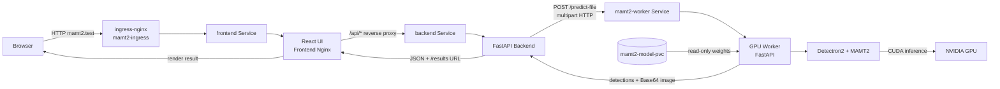
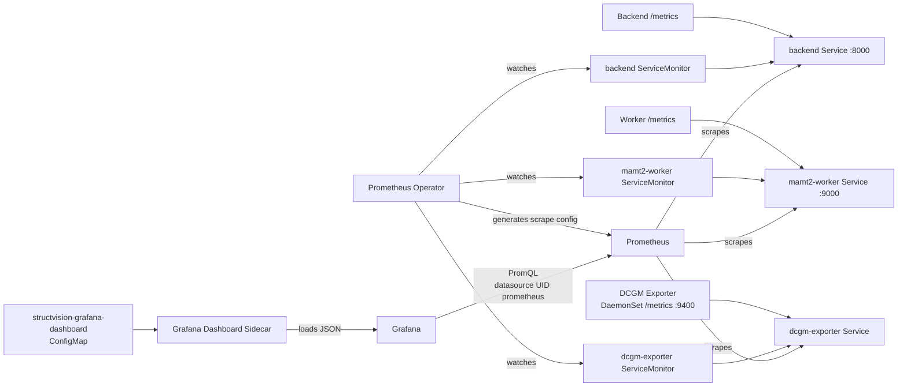
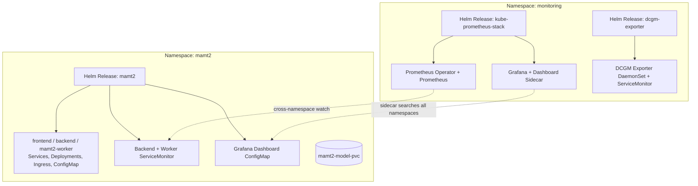

# StructVision Cloud Architecture

## 范围

StructVision Cloud v1.0 是面向单节点 GPU Kubernetes 环境的同步视觉推理系统。应用 Release 与监控 Release 相互独立，通过 ServiceMonitor、Prometheus 和 Grafana Dashboard ConfigMap 连接业务数据流与可观测性数据流。

## 请求链路

### 业务数据流

1. Frontend 只面对浏览器，所有 API 请求通过前端 Nginx 的 `/api/` 代理进入 Backend。
2. Backend 将上传图片写入 Pod 临时目录，然后同步上传给 Worker 的 `/predict-file`。
3. Worker 首次请求时懒加载 PVC 中的模型权重，随后复用进程内 predictor。
4. Detectron2/MAMT2 在 NVIDIA GPU 上完成 bbox、score、class 和 mask 推理。
5. Worker 将结果图编码为 Base64 返回；Backend 落盘后返回可访问的结果 URL。
6. Backend 与 Worker 不共享上传或结果目录；容器间的数据传递使用 HTTP，而模型权重通过 PVC 提供。

## 可观测性链路

### 可观测性数据流

- Backend 暴露 HTTP 请求、Worker 调用次数和 Backend-to-Worker 延迟。
- Worker 暴露推理结果、推理延迟、并发、模型加载状态和检测实例数量。
- DCGM Exporter 作为节点级 DaemonSet 暴露 GPU 利用率、显存、温度和功耗；它不申请 GPU extended resource，因此不会抢占 Worker 的唯一 GPU。
- Prometheus Operator 根据三个 ServiceMonitor 发现目标。应用 ServiceMonitor 位于 `mamt2`，DCGM ServiceMonitor 位于 `monitoring`。
- Grafana 使用固定 UID `prometheus` 查询 Prometheus；Sidecar 从 `mamt2` Namespace 自动加载 Dashboard ConfigMap。

## Helm Release 与 Namespace

- `.Release.Namespace` 将应用 Chart 的资源创建到安装 Release 时选择的 Namespace，推荐使用 `mamt2`。
- 应用资源名保持为 `frontend`、`backend`、`mamt2-worker`、`mamt2-config` 和 `mamt2-ingress`，保证集群内 DNS 与现有请求链路不变。
- kube-prometheus-stack 和 dcgm-exporter 是 `monitoring` Namespace 中的独立 Release。升级或卸载监控不会改变应用业务资源。
- Prometheus 的 ServiceMonitor Namespace selector 和 Grafana Sidecar 均配置为跨 Namespace 搜索，因此监控 Release 无需与应用 Release 位于同一 Namespace。
- Dashboard JSON 属于应用版本，由应用 Helm Release 通过 ConfigMap 声明式发布；checksum annotation 反映 Dashboard 内容变化。

## GPU 调度与发布策略

Worker 同时设置 `requests` 和 `limits` 的 `nvidia.com/gpu: 1`。在只有一张 GPU 的节点上，Kubernetes 无法同时调度两个 Worker Pod。Deployment 因此使用 `Recreate`：旧 Pod 完全退出并释放 GPU 后，才创建新 Pod。这会产生短暂不可用窗口，但避免 RollingUpdate 因第二个 Pod 无 GPU 可用而停滞。

DCGM Exporter 读取节点 GPU 遥测，但不声明 `nvidia.com/gpu`，所以它能与 Worker 共存而不消费可调度 GPU resource。

## 存储边界

- 模型权重位于 `mamt2-model-pvc`，独立于 Worker 生命周期并只读挂载。
- Worker 可视化中间输出位于 Worker Pod 的 `emptyDir`。
- Backend 上传图片与最终结果位于 Backend Pod 临时文件系统。
- v1.0 没有对象存储和数据库；Pod 重建会清除上传与结果文件，但不会删除 PVC 模型权重。

## v1.0 扩展方向

同步 HTTP 链路适合当前演示和单图推理。后续可在 Backend 与 Worker 之间加入 Redis/Celery 队列，用 MinIO 持久化图片，用 MySQL/PostgreSQL 保存任务元数据，并在多 GPU 节点上实施队列驱动的水平扩缩容。
